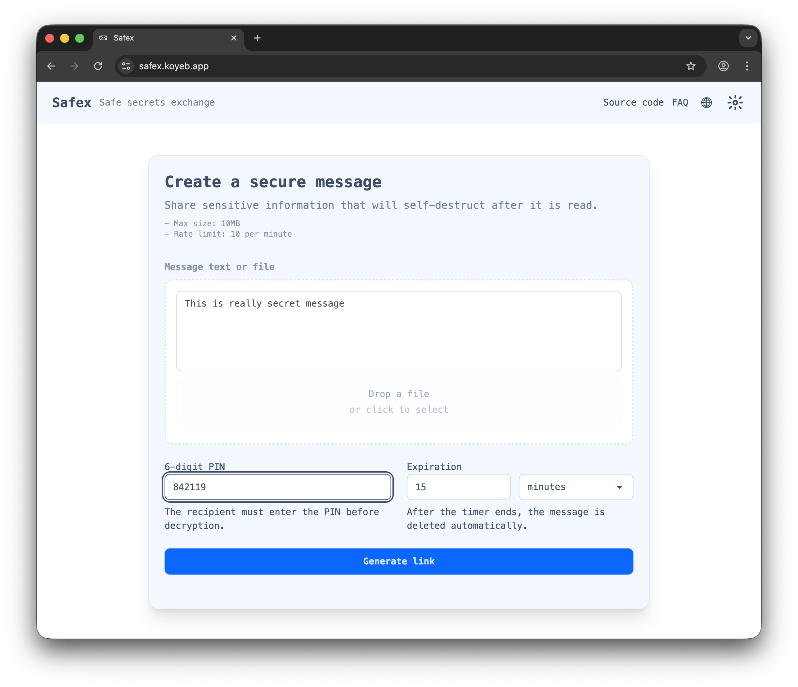
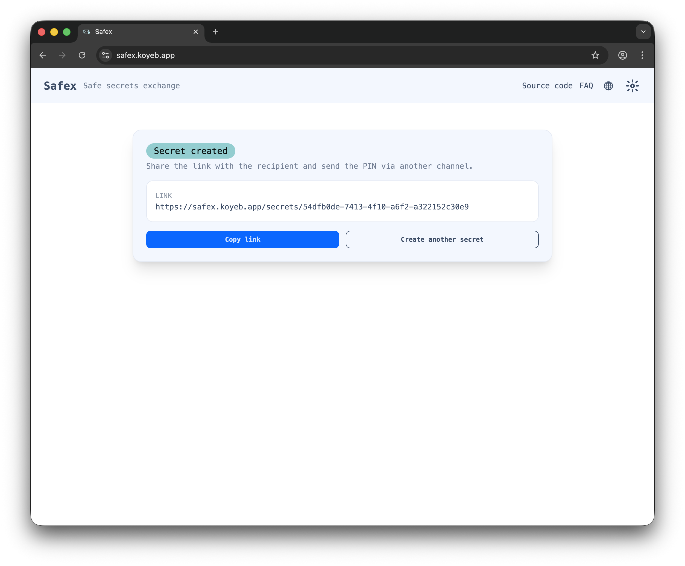
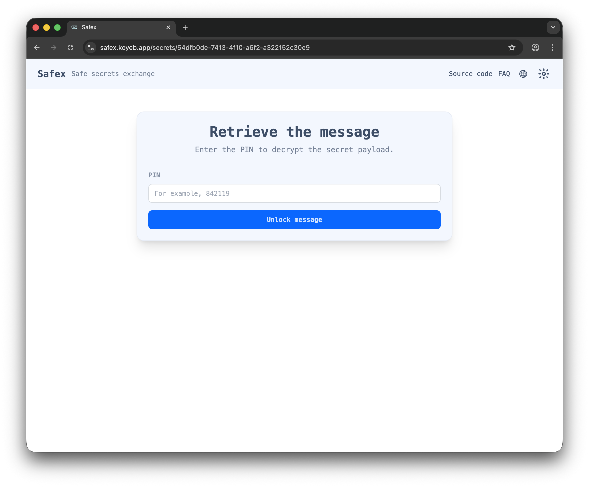
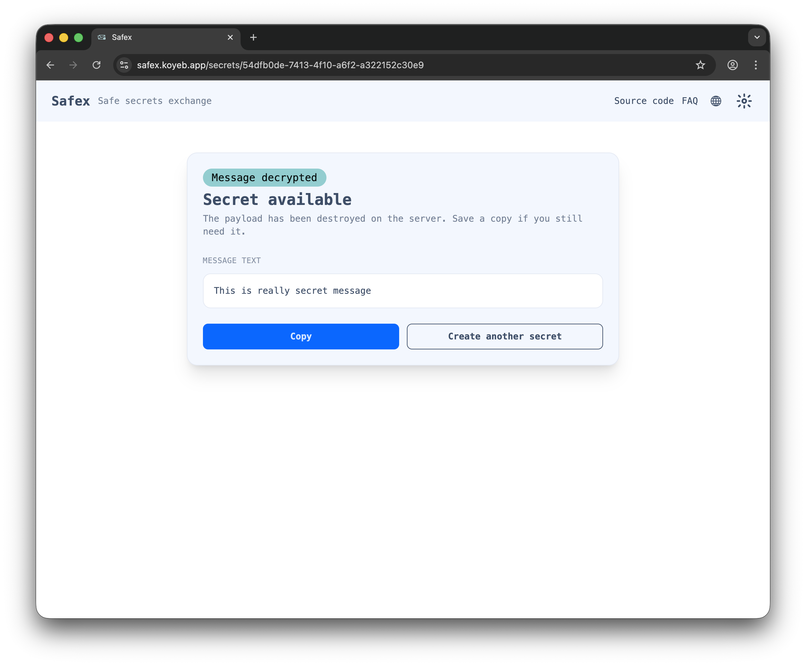

# Safex

  <strong>Safe secret exchange</strong> 
  
  
  
  

Safex is a security‑first secret sharing service that keeps sensitive data <strong>with zero server trust</strong>. It’s run for real on [Koyeb](https://safex.koyeb.app), so you can try it right now. You can also run your own Docker image from [GHCR](https://github.com/gonfff/safex/pkgs/container/safex), or build it yourself because the entire project is open source.

## Core concepts

- Secrets are <strong>encrypted and decrypted locally in the browser</strong> with WebAssembly (WASM) before they ever touch the server, so backend compromises never expose cleartext data.
- The recipient <strong>must prove knowledge of the PIN</strong> via the OPAQUE protocol before any download, blocking offline brute-force attacks and network PIN transmission.
- Expiration policies and view limits ensure every shared secret has a defined lifetime and data will be <strong>destroyed automatically after reading or expiry</strong>.

## How safety is achieved

- Secrets are encrypted and decrypted locally in the browser with WebAssembly (WASM).
- Secrets are stored encrypted on the server, which has no access to plaintext data.
- Safex does not receive PINs at any point, thanks to the OPAQUE protocol.
- No sensitive information is written to any logs.
- Messages are permanently deleted as soon as they are read or expire.
- An attacker needs both the unique link and the PIN to intercept a message.
- The code is open source and can be audited by anyone.

## Documentation

A full walkthrough is available on the [Docs page](https://gonfff.github.io/safex/).

### Warning

Redis and S3 backends not tested yet!!!

## Usage

1. Create a new secret with text or file, set expiration and choose a PIN.
   
2. Share the generated link and PIN with the recipient via separate channels.
   
3. The recipient opens the link, enters the PIN, and retrieves the secret.
   
4. Read/download/copy the secret before it self-destructs.
   
