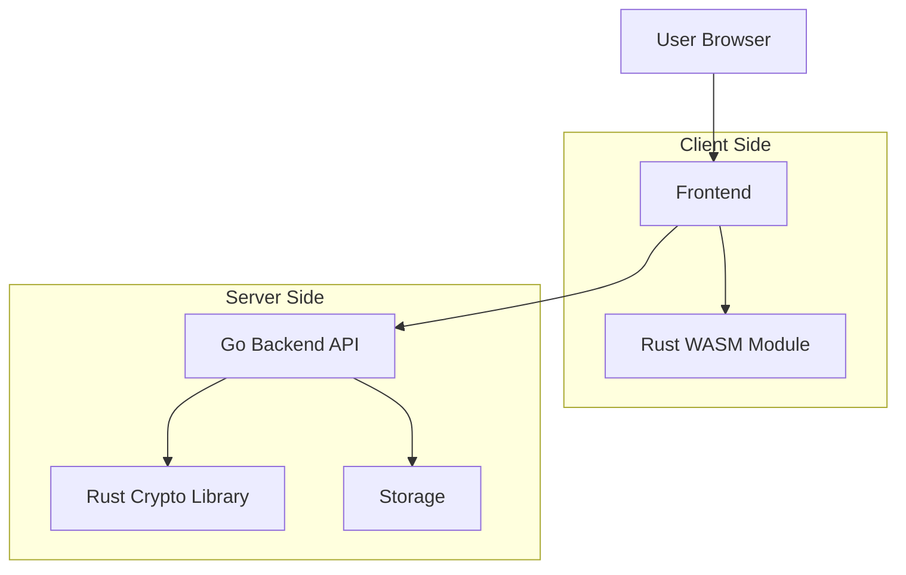
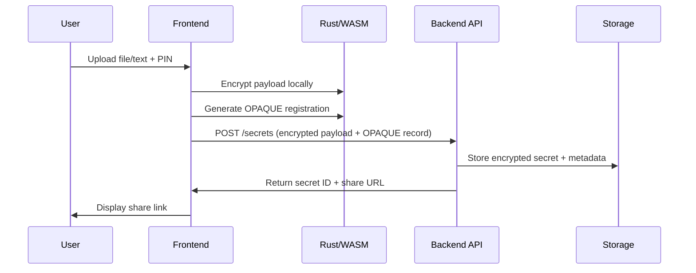
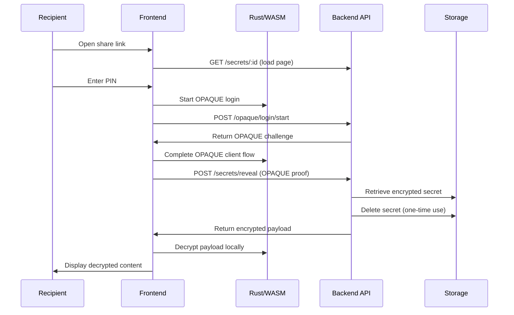

# Architecture Overview

The application consists of three main technologies working together: Go backend, Rust cryptographic library, and TypeScript/WASM frontend.

## High-Level Architecture

## Component Overview

### Frontend Layer

- **Technology**: HTMX + TailwindCSS + WebAssembly
- **Responsibilities**:
  - User interface and form handling
  - Client-side encryption/decryption using WASM
  - OPAQUE protocol client implementation
- **Key Files**: `frontend/`, `app/web/templates/`

### Backend API Layer

- **Technology**: Go with Gin framework
- **Architecture**: Clean Architecture with layers:
  - **Presentation**: HTTP handlers (`internal/handlers/`)
  - **Application**: Use cases (`internal/usecases/`)
  - **Domain**: Business logic (`internal/domain/`)
  - **Infrastructure**: External concerns (`internal/adapters/`, `internal/infrastructure/`)

### Cryptographic Layer

- **Technology**: Rust with WebAssembly compilation
- **Responsibilities**:
  - AES-GCM encryption/decryption
  - OPAQUE password-authenticated key exchange
  - Key derivation and management
- **Key Files**: `rust/src/`

## Data Flow

### Secret Creation Flow

### Secret Retrieval Flow

## Security Model

### Client-Side Security

- All encryption/decryption happens in the browser using WebAssembly
- PIN never leaves the client in plaintext (OPAQUE protocol)
- Encryption keys are derived from PIN and never transmitted

### Server-Side Security

- Server only stores encrypted payloads and OPAQUE records
- No access to plaintext secrets or PINs
- Automatic deletion after retrieval or expiration
- Rate limiting and payload size restrictions

### Communication Security

- HTTPS for all communications
- CSRF protection via Gin middleware
- Request validation and sanitization

## Storage Architecture

### Metadata Storage

- **Options**: BoltDB (local) or Redis (distributed)
- **Data**: Secret metadata, expiration times, OPAQUE records

### Blob Storage

- **Options**: Local filesystem or S3-compatible storage
- **Data**: Encrypted secret payloads
