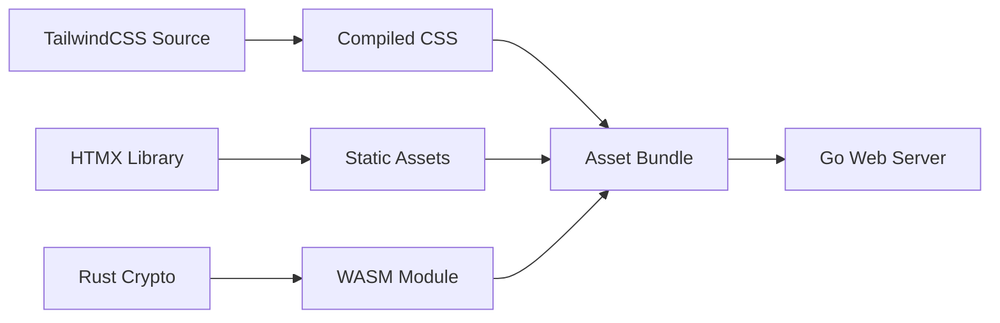
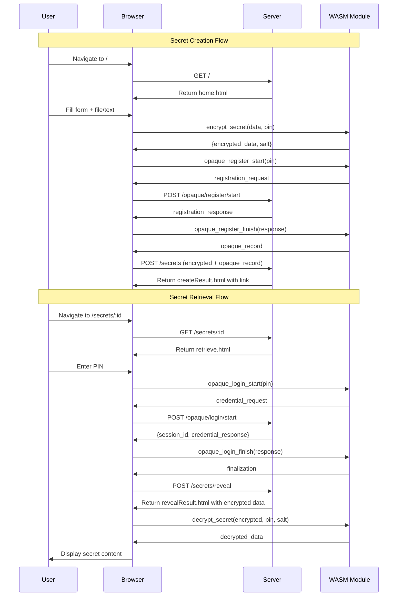

# Frontend & WebAssembly Documentation

The Safex frontend combines modern web technologies with WebAssembly for secure client-side cryptography.

## Technology Stack

### Core Technologies

- **HTMX**: Dynamic HTML over the wire
- **TailwindCSS + DaisyUI**: Utility-first CSS framework
- **WebAssembly (WASM)**: Client-side cryptographic operations
- **Go Templates**: Server-side HTML templating

### Build Pipeline

## Frontend Architecture

### Page Flow

