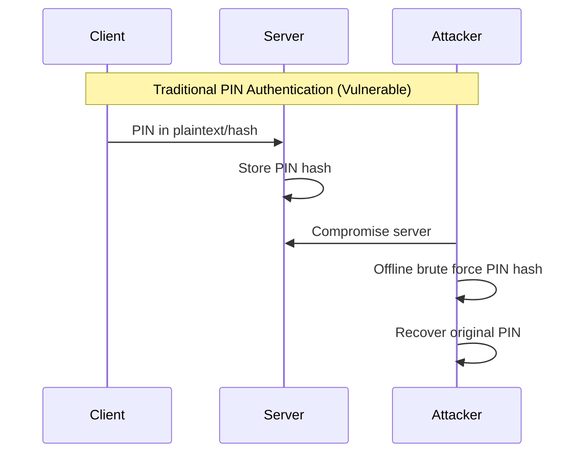
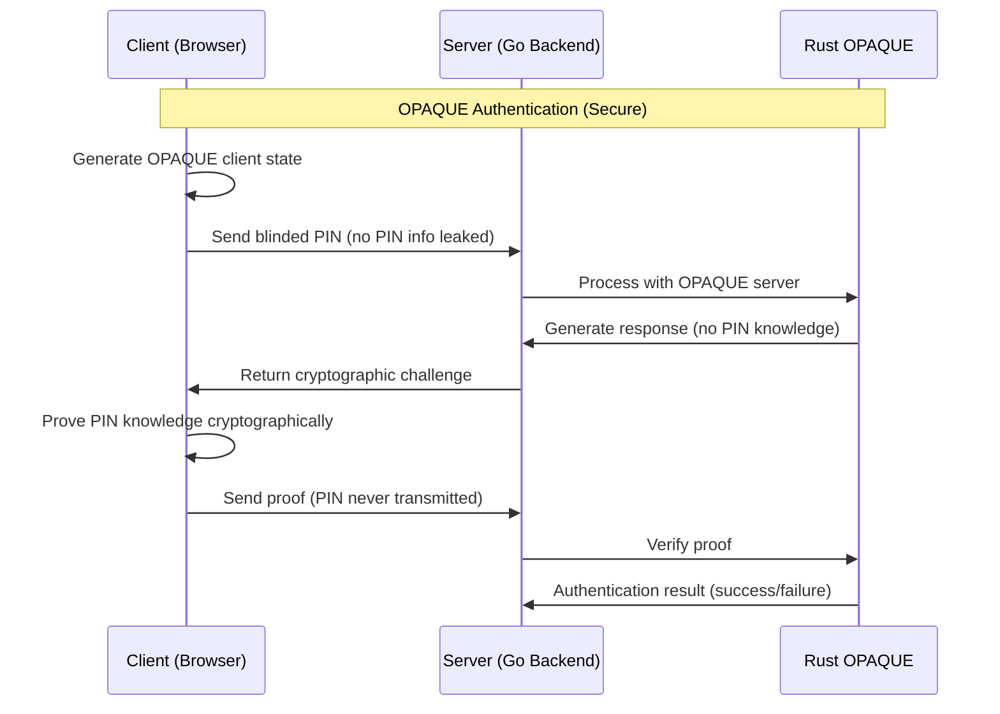
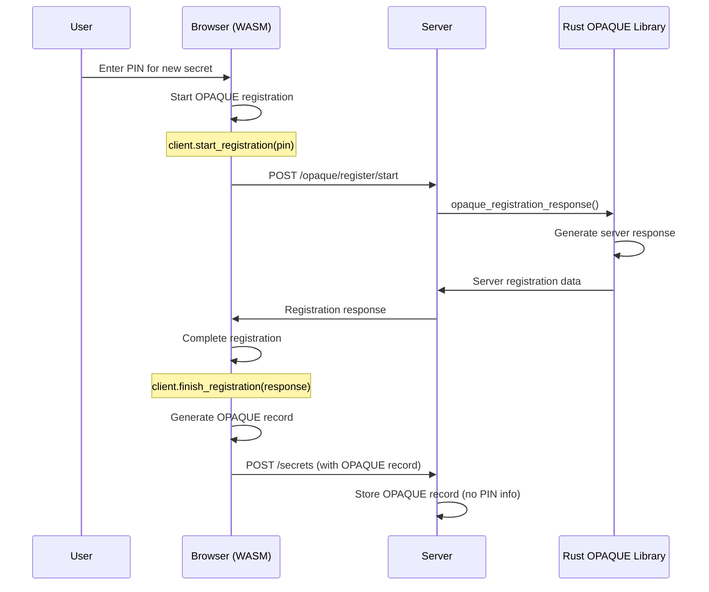
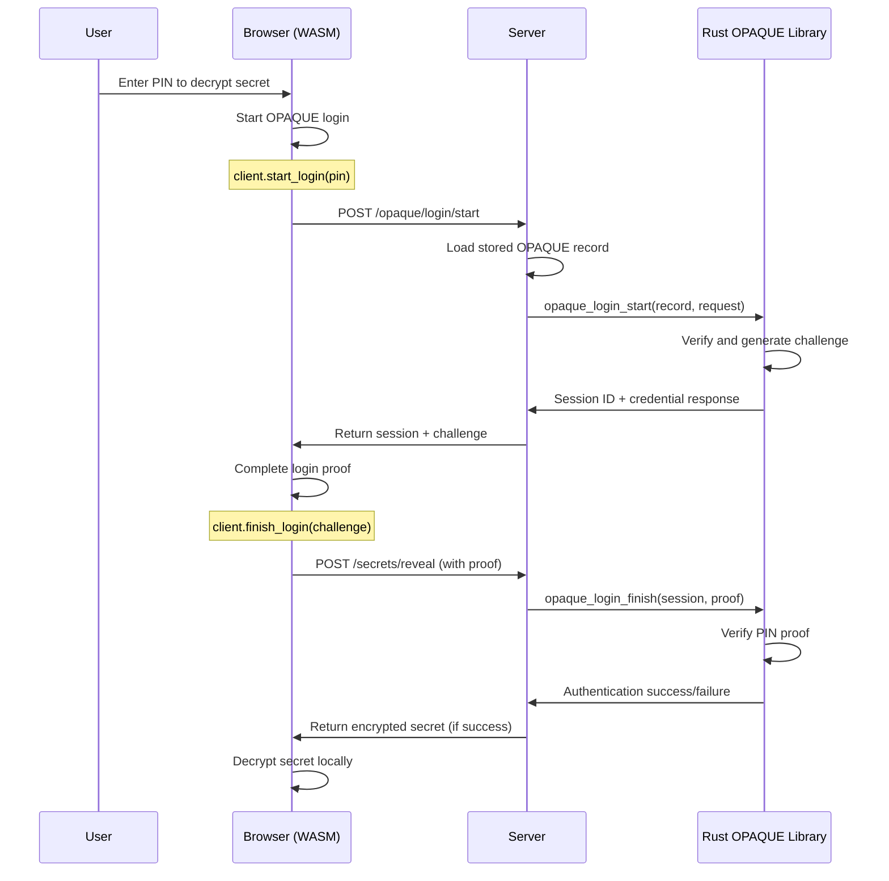

# OPAQUE Protocol in Safex

OPAQUE (Oblivious Pseudorandom Functions with Applications to Key Exchange) is a modern password-authenticated key exchange (PAKE) protocol that provides advanced security properties for PIN-based authentication in Safex.

## Why OPAQUE?

### Traditional PIN Problems

In typical systems, PIN verification has several vulnerabilities:

**Security Issues**:

- Server sees the PIN (even if hashed)
- Server compromise exposes PIN hashes
- Offline brute-force attacks possible
- Network eavesdropping can reveal PINs

### OPAQUE Solution

OPAQUE eliminates these vulnerabilities through cryptographic innovation:

**Security Advantages**:

- ✅ Server never sees the PIN
- ✅ No offline attacks possible
- ✅ Network traffic reveals nothing about PIN
- ✅ Quantum-resistant cryptography

## How OPAQUE Works in Safex

### Registration Flow (Secret Creation)

When a user creates a secret with a PIN:

### Login Flow (Secret Retrieval)

When a user wants to retrieve a secret:

