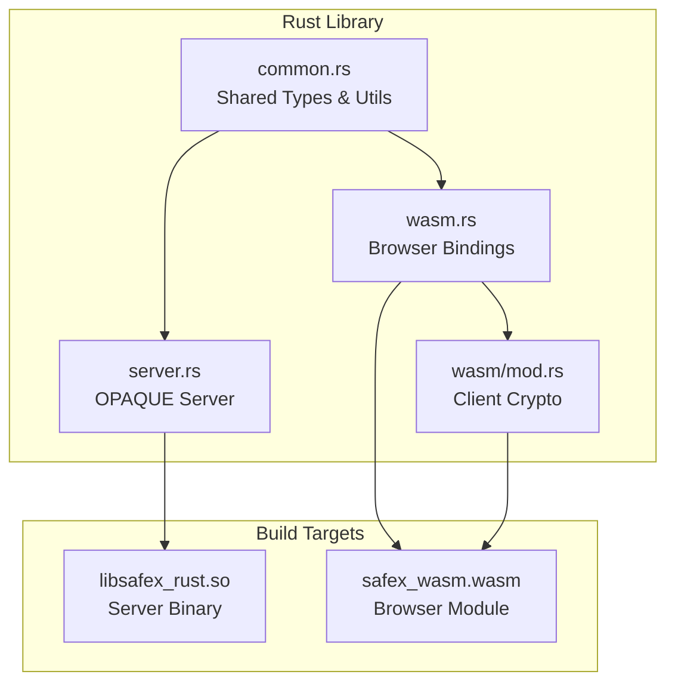

# Rust Components

This document describes the Rust components that provide cryptographic functionality for Safex.

## Overview

The Rust codebase provides two main builds:

- **Server Library** (`libsafex_rust.so`): Used by the Go backend for OPAQUE authentication
- **WebAssembly Module**: Used by the browser frontend for client-side encryption

## Architecture

## Security Considerations

### Cryptographic Parameters

- **AES-256-GCM**: Provides authenticated encryption
- **Argon2id**: Memory-hard key derivation (64MB, 2 iterations, 4 threads)
- **OPAQUE with Ristretto255**: Quantum-resistant PAKE protocol
- **Random nonces**: 96-bit nonces for AES-GCM

### Memory Safety

- All sensitive data cleared after use
- Rust's ownership system prevents memory leaks
- WASM provides sandboxed execution environment

### Side-Channel Protection

- Constant-time operations where possible
- Argon2id resistant to timing attacks
- OPAQUE protocol resistant to offline attacks
